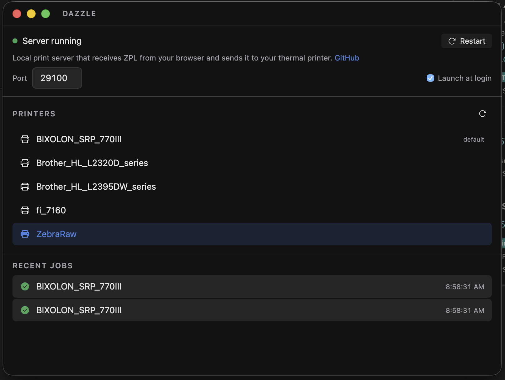

# Dazzle

> _A group of zebras is called a "dazzle"_

A lightweight, open-source Tauri desktop app for printing ZPL directly to thermal label printers. Cross-platform (Mac, Windows, Linux) and free alternative to QZ Tray.



## Features

- Printer discovery and selection
- Raw ZPL printing to thermal/label printers
- HTTP server for receiving print jobs from web apps
- System tray with status indicator
- Auto-start on login (optional)
- Print queue/history view
- Configurable port (default: 29100)

## Install

Download the latest release for your platform from [GitHub Releases](https://github.com/StirlingMarketingGroup/dazzle/releases).

- **macOS**: `.dmg`
- **Windows**: `.msi`

Dazzle runs in the system tray. Enable "Launch at login" in the app to start it automatically.

## Supported Printers

- Zebra printers (ZPL native)
- Bixolon SRP-770III (ZPL emulation)
- Any thermal printer with ZPL support

## Client Library

Install the TypeScript client for easy integration:

```bash
npm install dazzle-zpl
```

```typescript
import { Dazzle } from 'dazzle-zpl';

const dazzle = new Dazzle();

// CORS-safe status check (no console errors when server is down)
if (await dazzle.isRunning()) {
  // Print a ZPL string
  await dazzle.print('^XA^FO50,50^A0N,50,50^FDHello World^FS^XZ');

  // Print from a URL (fetches as binary, base64-encodes automatically)
  await dazzle.printURL('https://cdn.example.com/label.zpl');

  // Print multiple labels in order
  await dazzle.printURLs([label1Url, label2Url, label3Url]);

  // Print raw bytes (Uint8Array or ArrayBuffer)
  await dazzle.print(uint8Array);

  // Print to a specific printer
  await dazzle.printURL(labelUrl, { printer: 'Zebra_ZD420' });

  // List available printers
  const printers = await dazzle.printers();
}
```

All `print` methods automatically base64-encode data for binary-safe transmission — no manual encoding needed.

## HTTP API

The server listens on `http://localhost:29100` by default (configurable in the app).

### `POST /print`

Send ZPL to the selected printer.

#### Binary-safe printing with base64 (recommended)

**If your ZPL contains binary image data** (e.g. `^GF` graphic fields, shipping label logos), you **must** use base64 encoding. Sending raw binary through `fetch()` will corrupt image data because the browser encodes the body as UTF-8.

```js
// Fetch ZPL as binary to preserve image data
const response = await fetch('https://example.com/label.zpl');
const buffer = await response.arrayBuffer();

// Base64 encode the raw bytes
const bytes = new Uint8Array(buffer);
const CHUNK_SIZE = 0x8000;
const chunks = [];
for (let i = 0; i < bytes.length; i += CHUNK_SIZE) {
  chunks.push(String.fromCharCode(...bytes.subarray(i, i + CHUNK_SIZE)));
}

// Send to Dazzle with base64 encoding
await fetch('http://localhost:29100/print?encoding=base64', {
  method: 'POST',
  body: btoa(chunks.join('')),
});
```

Or just use the client library which handles all of this:

```js
await dazzle.printURL('https://example.com/label.zpl');
```

#### Plain text ZPL (ASCII only)

If your ZPL is pure ASCII (no binary graphics), you can send it directly:

```js
await fetch('http://localhost:29100/print', {
  method: 'POST',
  body: '^XA^FO50,50^A0N,50,50^FDHello World^FS^XZ',
});
```

#### Query parameters

| Parameter  | Description                                                                                                      |
| ---------- | ---------------------------------------------------------------------------------------------------------------- |
| `encoding` | Set to `base64` to have the server decode the body before printing. **Required for ZPL with binary image data.** |
| `printer`  | Override the selected printer by name (e.g. `?printer=ZebraRaw`). Falls back to the printer selected in the app. |

#### Responses

- `200` — `{ "job_id": "..." }` — printed successfully
- `400` — empty body, invalid base64, or no printer selected
- `413` — body too large (max 10 MB)
- `500` — print command failed

### `GET /status`

Check if the server is running. Use this to detect if Dazzle is installed.

```js
async function isDazzleRunning() {
  try {
    const res = await fetch('http://localhost:29100/status');
    return res.ok;
    // { "status": "running", "version": "0.1.2" }
  } catch {
    return false; // Dazzle is not running
  }
}
```

### `GET /printers`

List available printers.

```js
const res = await fetch('http://localhost:29100/printers');
const printers = await res.json();
// [{ "name": "ZebraRaw", "is_default": true }, ...]
```

## Tech Stack

- **Tauri 2.0** — Rust backend, tiny binary (~5 MB)
- **React 19** — UI
- **Axum** — HTTP server for print jobs
- **Platform printing:**
  - Mac/Linux: `lp -d <printer> -o raw`
  - Windows: Win32 raw spool API

## Development

### Prerequisites

- [Node.js](https://nodejs.org/) 18+
- [Rust](https://www.rust-lang.org/tools/install) 1.77+
- Platform-specific Tauri dependencies ([see docs](https://v2.tauri.app/start/prerequisites/))

### Setup

```bash
npm install
npm run tauri dev
```

### Build

```bash
npm run tauri build
```

## Related

- [Marlin](https://github.com/StirlingMarketingGroup/marlin) — Our Tauri file browser (same pattern)
- [go-zpl](https://github.com/StirlingMarketingGroup/go-zpl) — Our ZPL library

## License

MIT
